# LAICRAFTS Order Management Platform

A full-stack e-commerce and operations platform that runs LAICRAFTS, a handcrafted memory-frame business, from customer checkout to batch production and shipping.

**700+ orders processed since March 2026** · Live at [laicrafts.studio](https://laicrafts.studio)

> This is a showcase repository. The platform's source code is private because it runs a live business. It can be walked through in an interview, and access can be granted on request.

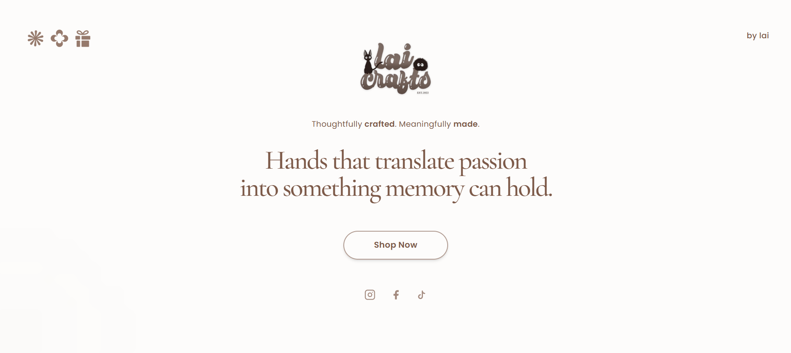

## What I Built

I designed, built and maintain the platform myself, and I also run the business it powers.

- Built the full stack before launch: customer ordering flow, admin dashboard, database and deployment (Next.js, React, MySQL, Vercel).
- Designed batch-based production scheduling with per-product capacity and rush tiers, enforced on the server inside database transactions with row locking.
- Built an LLM feature (Groq API) that turns customers' photo stories into museum-style captions, with structured JSON output, a fallback model, retries and timeouts.
- Automated 7 customer email workflows and a per-batch bill of materials for production planning.
- Built an in-browser image pipeline: compression, a crop editor, canvas photo filters and print-ready card export.
- Added features based on feedback from the 3-person fulfillment team I hired, to cut their manual work.

## The Problem

Each product is a handmade frame built from a customer's own photos and stories, produced in limited batches. That means every order involves 7 to 12 photos with descriptions, product options, capacity limits per batch, manual GCash payment checks, and printed exhibit cards. Handling this through chat messages would not scale, so the system was built before the business opened.

## Screenshots

Customer names, contact details, photos, personal stories and payment account details have been blurred.

| | |
|---|---|
| 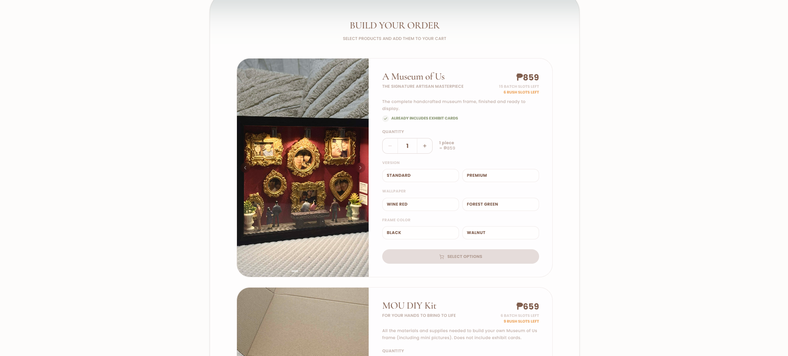 | 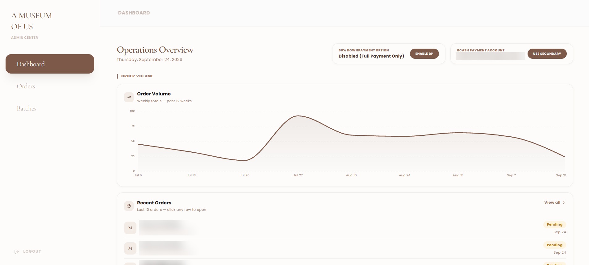 |
| **Order builder** with live batch and rush slot availability | **Operations dashboard** with weekly order volume |
| 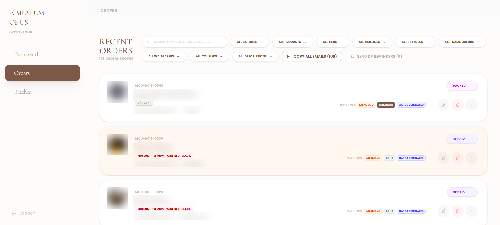 | 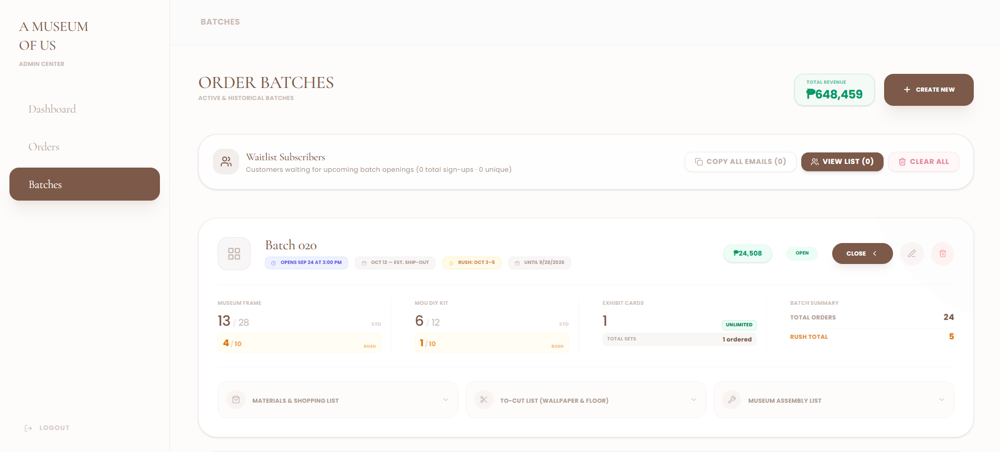 |
| **Order management** with 9 filters and bulk actions | **Batch management** with capacity, revenue and production lists |
| 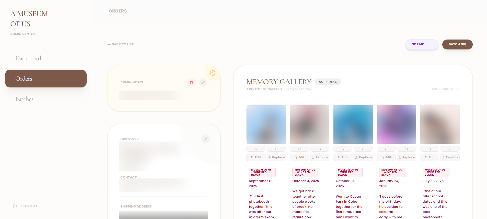 | 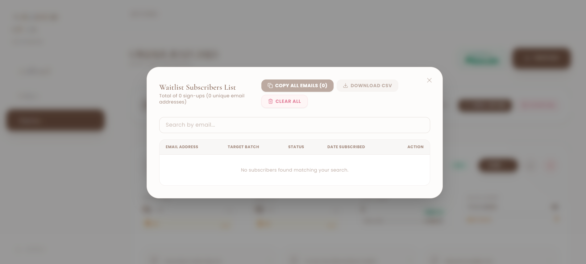 |
| **Order detail**: memory gallery with drag-and-drop ordering, photo editing and replacement | **Waitlist** with CSV export and batch-open notifications |

### Production planning

For every batch, the platform turns its orders into exact production lists, split into rush and standard orders.

| | |
|---|---|
| 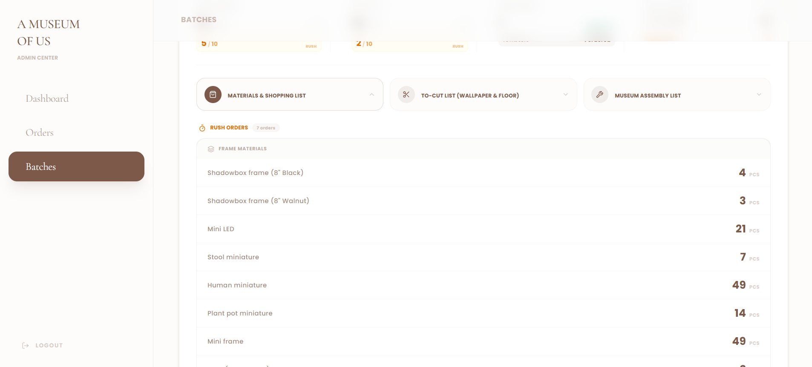 |  |
| **Materials and shopping list**: frames, LEDs, miniatures and supplies to buy | **To-cut list**: wallpaper parts by color and size, flooring, and frames to prepare |
| 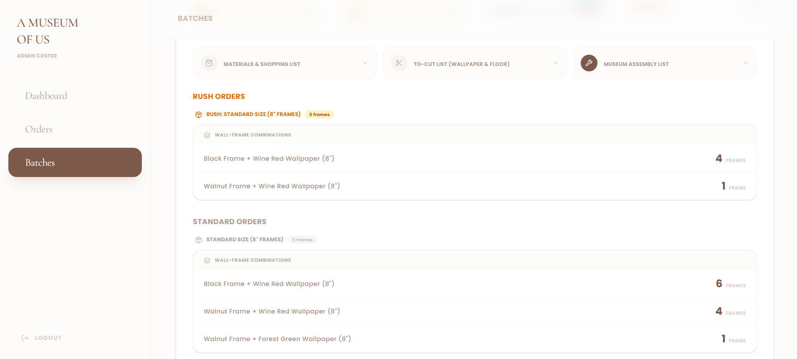 | |
| **Assembly list**: frame and wallpaper combinations to build | |

### Customer checkout experience

| | |
|---|---|
| 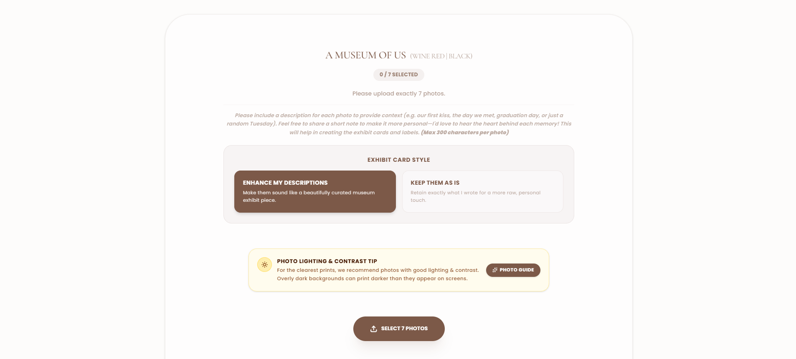 | 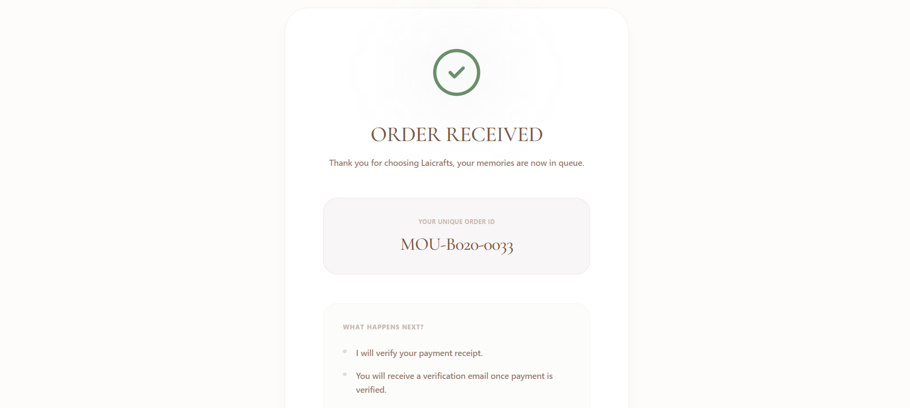 |
| **Photo upload step**: exact photo count per product, a description for each photo, and a choice between AI-enhanced or as-is captions | **Order confirmation** with a unique order ID generated inside the order transaction |
| 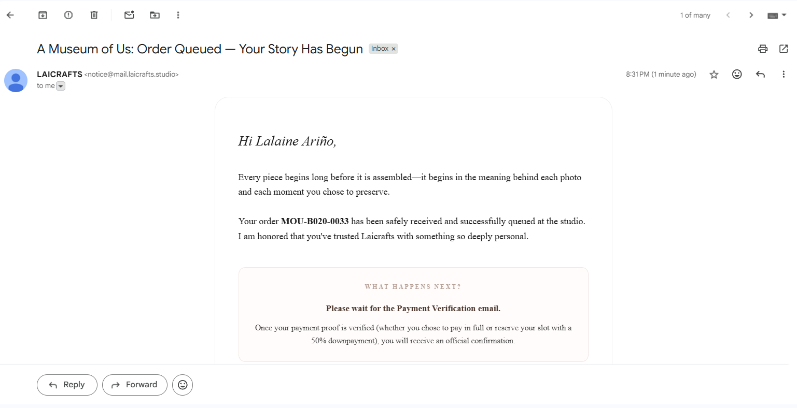 | 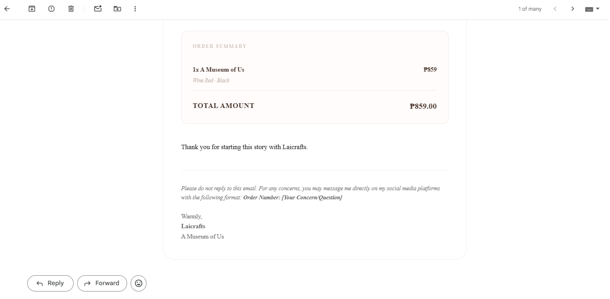 |
| **Automated email** sent from the studio's own domain after the order is saved | **Itemized receipt** calculated on the server |

### From customer story to printed exhibit card

Each customer writes a short story for every photo. The platform turns those stories into museum-style exhibit cards, ready to print.

| | |
|---|---|
| 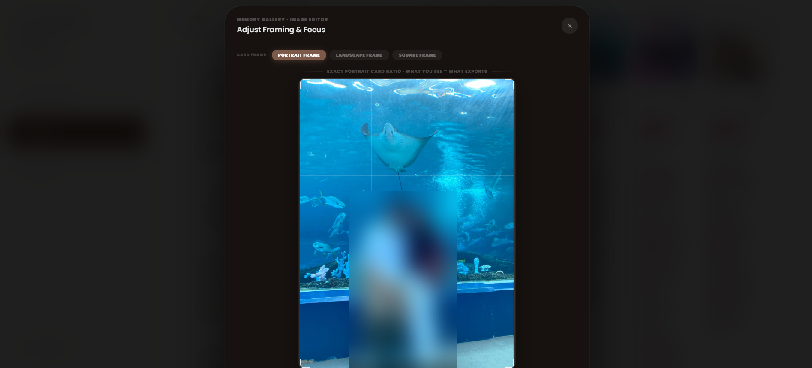 | 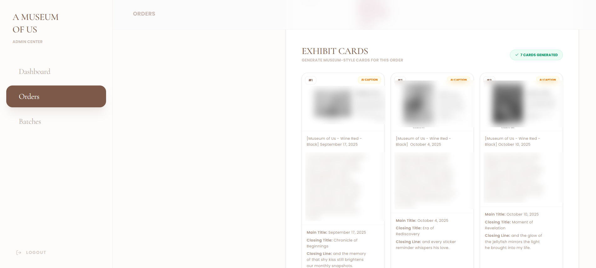 |
| **1. Crop editor**: the preview uses the same crop math as the export, so what you see is exactly what prints | **2. AI captions**: an LLM generates a title, closing title and closing line for each card while keeping the customer's own words |
| 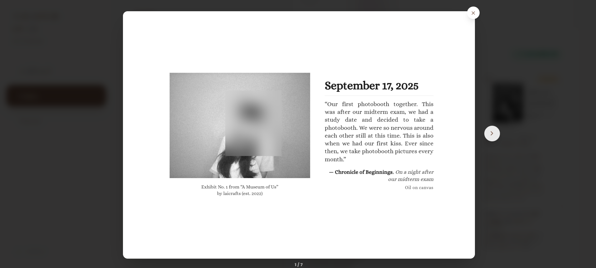 | |
| **3. Final card**: black-and-white film filter processed on a canvas, exported at print resolution | |

## Key Features

**Customer ordering**
- Six-step order form: products and options, batch selection, details, photo uploads with a description per photo, courier choice, and payment proof
- Client-side image compression and direct uploads to Cloudinary
- A unique order ID per order (for example `MOU-B020-0024`) and an automatic confirmation email

**Batch and capacity scheduling**
- Separate capacity per product line for standard and rush orders, calculated live from existing orders
- Rush tiers (7, 5, 3 and 2 days) with per-batch pricing and on/off switches
- Waitlist sign-ups with batch-open email notifications

**Operations**
- Dashboard with a 12-week order trend, order status pipeline and PDF report export
- Order management with search, 9 filters, drag-and-drop photo ordering, photo cropping and replacement
- Bill of materials, cutting list and assembly list generated for each batch

**AI captions and exhibit cards**
- LLM-generated museum-style captions that keep the customer's voice and do not invent facts
- Browser-rendered, high-resolution exhibit cards with a custom black-and-white film filter, exported as a ZIP per order

**Automated emails**
- Order queued, payment confirmed, downpayment received, shipping fee request, shipped, balance reminders and batch-open alerts (Resend)

## Tech Stack

| Layer | Technology |
| --- | --- |
| Framework | Next.js 14 (App Router), React 18 |
| Styling | Tailwind CSS, Framer Motion |
| Database | MySQL (mysql2, connection pooling, transactions) |
| Media | Cloudinary, browser-image-compression |
| Email | Resend |
| AI | Groq API (LLM caption generation) |
| Documents and charts | html2canvas, jsPDF, JSZip, Recharts |
| Hosting | Vercel (app), Railway (MySQL) |

## Architecture

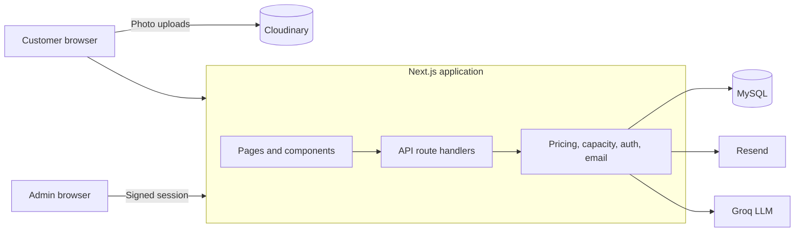

Order creation runs in a single database transaction: it locks the batch row, checks capacity, recomputes all prices on the server, generates the order ID, and saves the order with its photos. If any step fails, the whole order is rolled back.

## Security

- Signed, expiring admin session tokens (HMAC-SHA256) in `httpOnly`, `sameSite=strict` cookies, with login rate limiting
- Server-side price and capacity validation; client-submitted amounts are ignored
- Row locking to prevent overbooking under concurrent checkouts
- Parameterized SQL queries and HTML escaping of user text in emails
- Uploaded image URLs restricted to the platform's own Cloudinary account
- All credentials and payment details kept in environment variables

## Roadmap

- Customer order-tracking page with secure lookup links
- Online payment gateway to replace manual proof verification
- Automated tests for pricing, capacity and authentication
- Versioned database migrations

## Author

**Lalaine S. Ariño**, Founder and Full-Stack Developer · [LinkedIn](https://www.linkedin.com/in/lalaine-arino-026770284) · [GitHub](https://github.com/lalainearino)
